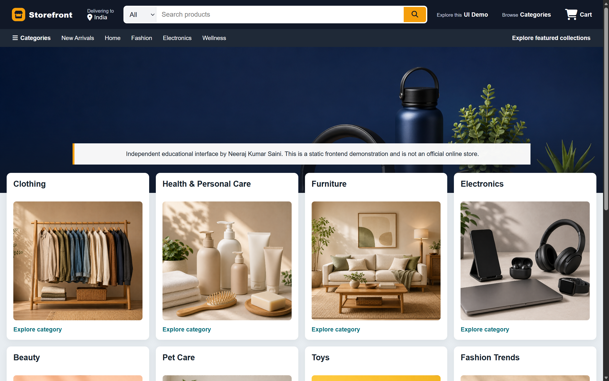

<p align="center">
    
</p>
<h1 align="center">E-Commerce Platform UI</h1>

A responsive e-commerce interface built with HTML5 and CSS3 to demonstrate modern layout composition, reusable styling, accessibility fundamentals, and responsive frontend design.

**Live Demo:** [https://ecommerce-platform-ui.vercel.app](https://ecommerce-platform-ui.vercel.app)

> **Independent educational project:** This project was created for learning and portfolio purposes. It is not affiliated with, endorsed by, or connected to Amazon or any other e-commerce company. All third-party trademarks belong to their respective owners.

## Preview



## Overview

E-Commerce Platform UI explores the structure of a modern online storefront, including responsive navigation, product search, promotional content, category cards, and an information-rich footer.

The interface was built from scratch as a frontend development exercise. The current version uses original **Storefront** branding, neutral interface wording, and original visual assets. It does not provide real user accounts, purchases, payments, or order processing.

## Features

- Responsive navigation with category selection and product search
- Original Storefront branding created with HTML and CSS
- Promotional hero section with an educational-project notice
- Eight product-category cards with original visual assets
- Product cards that overlap the lower hero area for a layered layout
- Responsive layouts built with CSS Grid, Flexbox, and media queries
- Accessible form labels and visible keyboard-focus states
- Structured footer with project, technology, and developer links
- Desktop, tablet, and mobile breakpoints
- Automatic Vercel deployment from the `main` branch

## Product Categories

- Clothing
- Health and Personal Care
- Furniture
- Electronics
- Beauty
- Pet Care
- Toys
- Fashion Trends

## Tech Stack

- HTML5
- CSS3
- CSS Grid
- Flexbox
- Media queries
- Font Awesome icons
- Git and GitHub
- Vercel

## Getting Started

### 1. Clone the repository

```bash
git clone https://github.com/NeerajSaini271/Ecommerce-Platform-UI.git
```

### 2. Open the project directory

```bash
cd Ecommerce-Platform-UI
```

### 3. Run the project locally

Open `index.html` directly in a browser, or use a local development server such as the VS Code Live Server extension.

## Project Structure

```text
Ecommerce-Platform-UI/
├── Images/
│   ├── storefront-preview.png
│   ├── hero_image.png
│   ├── box1_image.png
│   ├── box2_image.png
│   ├── box3_image.png
│   ├── box4_image.png
│   ├── box5_image.png
│   ├── box6_image.png
│   ├── box7_image.png
│   └── box8_image.png
├── index.html
├── styles.css
└── README.md
```

## Responsive Design

- The desktop layout displays four category cards per row.
- The tablet layout reduces the grid to two cards per row.
- The mobile layout displays one card per row.
- Navigation elements adapt or hide at narrower viewport widths.
- The hero section and category cards use responsive spacing and sizing.

## Project Goals

- Practice complex layouts with CSS Grid and Flexbox
- Improve responsive behavior across common viewport sizes
- Strengthen semantic HTML and accessibility fundamentals
- Replace third-party brand identity with original project branding
- Present frontend development work in a portfolio-safe format
- Practice GitHub-based deployment workflows with Vercel

## Branding and Asset Notice

- The updated interface does not use official company logos or favicons.
- The project uses neutral Storefront branding.
- The interface does not collect real credentials, personal data, or payment information.
- The educational-project notice should remain visible in the deployed interface.
- Third-party trademarks belong to their respective owners.

## Deployment

The project is deployed on Vercel:

[https://ecommerce-platform-ui.vercel.app](https://ecommerce-platform-ui.vercel.app)

Changes pushed to the `main` branch are automatically deployed through the connected Vercel project.

## Author

**Neeraj Kumar Saini**

- GitHub: [NeerajSaini271](https://github.com/NeerajSaini271)
- LinkedIn: [neerajsaini271](https://www.linkedin.com/in/neerajsaini271)
- Email: [neerajkhetrisaini@gmail.com](mailto:neerajkhetrisaini@gmail.com)

## License

This project is licensed under the [MIT License](LICENSE). Third-party trademarks, logos, and media are not covered by the project's MIT License.
